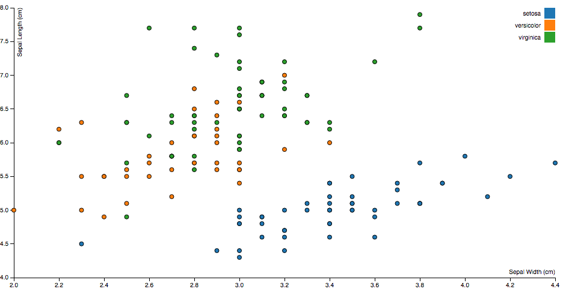

# Reusing d3 code with jetpack & starterkit

[1wheel.github.io/nyc-d3](http://1wheel.github.io/nyc-d3/#/)


## Adam Pearce
- [roadtolarissa.com](http://roadtolarissa.com)
- [bloomberg.com/graphics](https://bloomberg.com/graphics)
- [github.com/1wheel](https://github.com/1wheel)
- [@adamrpearce](https://twitter.com/adamrpearce)


## Scatter Plot I


[bl.ocks.org/1wheel](http://bl.ocks.org/1wheel/98129315d0f7df3b53e3)


##Great, but...
- 81 lines & 2284 characters of js

- Reuse with copy/paste


##d3-jetpack


- [github.com/gka/d3-jetpack](https://github.com/gka/d3-jetpack)


##appending with class
Before

````javascript
var legend = svg.selectAll(".legend")
    .data(color.domain())
  .enter().append("g")
    .attr("class", "legend")
````

After

````javascript
var legend = svg.selectAll(".legend")
    .data(color.domain())
  .enter().append("g.legend")
````


##appending with class
Works with multiples classes and ids

Before

````javascript
svg.append("g")
    .attr("class", "y axis")
    .call(yAxis)
  .append("text")
    .attr("class", "label")
````

After

````javascript
svg.append("g.y.axis")
    .call(yAxis)
  .append("text.label")
````


##translate
Before

````javascript
svg.append("g.x.axis")
    .attr("transform", "translate(0," + height + ")")
````

After

````javascript
svg.append("g.x.axis")
    .translate([0, height])
````


##translate
Before

````javascript
svg.append("g.x.axis")
    .attr("transform", "translate(0," + height + ")")
````

After

````javascript
svg.append("g.x.axis")
    .translate([0, height])
````


## Outline 
- `ƒ`: scales, identity for text, compose attrs
- `append('el.class`): axis, circle, legend
- `appendData`: circle, legend
- `conventions`: margin, scale, axis


## Links
[jetpack](https://github.com/gka/d3-jetpack)

[scatter plot](http://bl.ocks.org/mbostock/3887118)

[data munster](https://github.com/sarahgp/data-monster)

[d3kit](https://github.com/twitter/d3kit)

[rollup](https://github.com/rollup/rollup)

[come work with us!!!](http://jobs.bloomberg.com/job/New-York-Interactive-Graphic-Journalist-Job-NY/276897600/)
